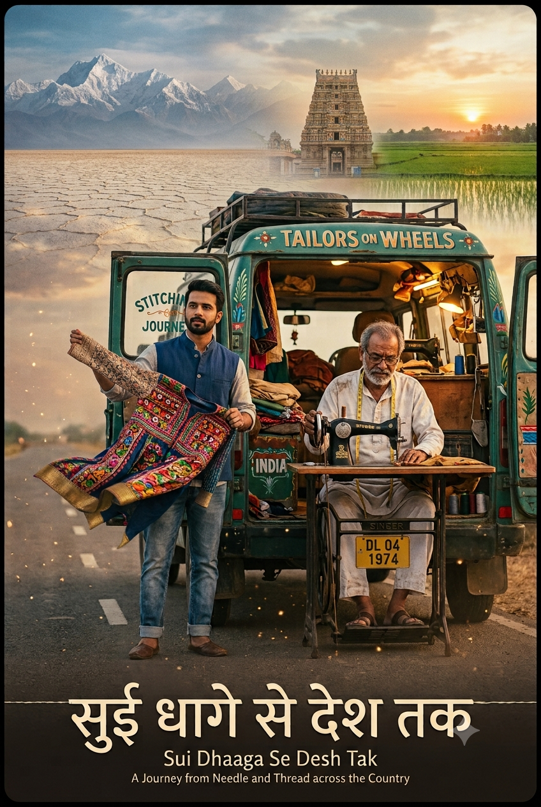
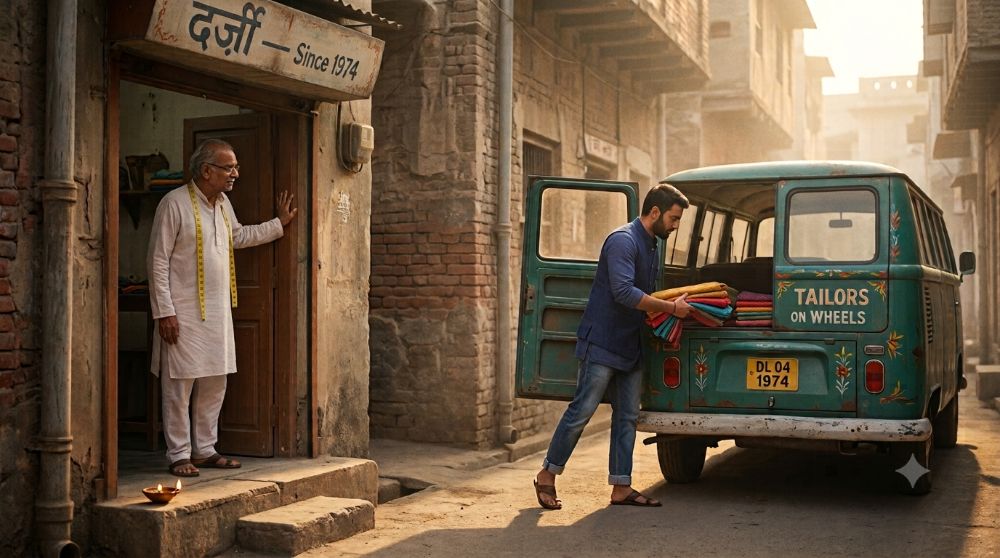
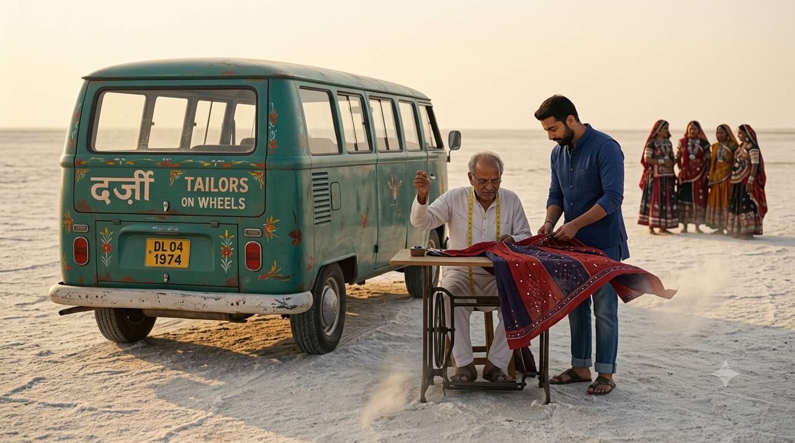
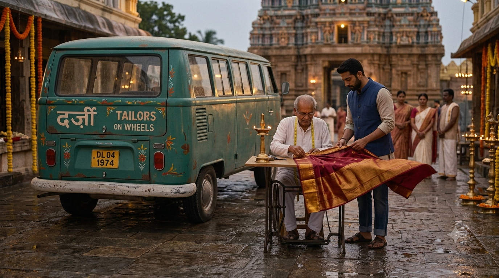
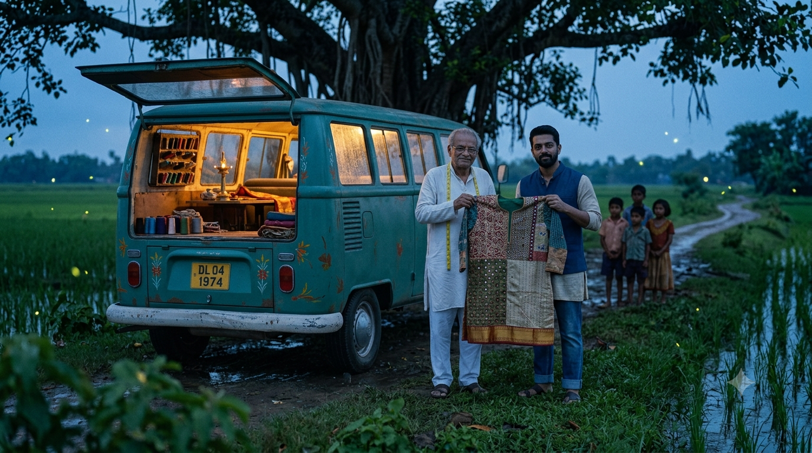
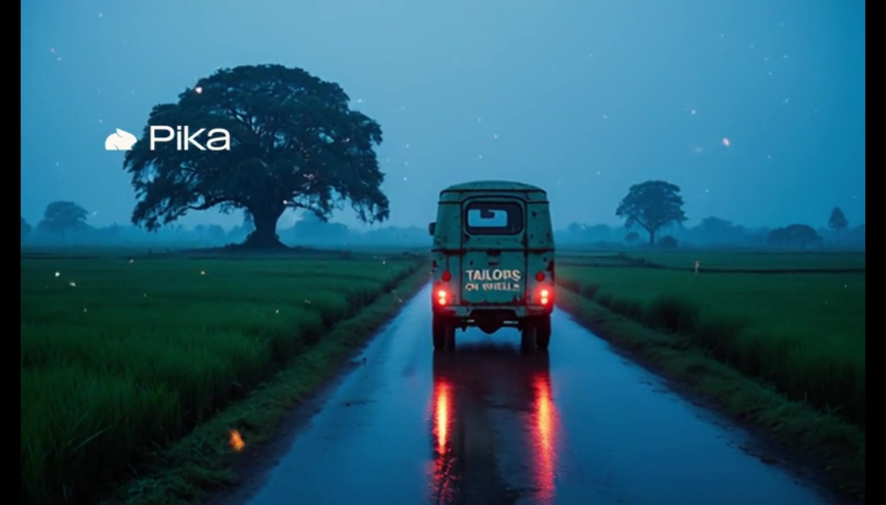

# AI Movie Lab

AI short films made end-to-end on free tools, documented so anyone can replicate them.

Conceptualized, created, and implemented by **Pathikrit Roy** (Kolkata, India).

---

## Case Study #01 - Sui Dhaaga Se Desh Tak (The Road Trip Tailors)

**सुई धागे से देश तक - "From Needle and Thread to the Nation"**

  

**▶ Watch the film:** [Sui Dhaaga Se Desh Tak | The Road Trip Tailors - a 25-second AI short film](https://youtu.be/rXJDMQSXumg)

An elderly tailor and his son take their 1970s mobile tailoring van across India - Kutch's salt desert, a South Indian temple town, and the paddy fields of Bengal - stitching one garment from the crafts they gather along the way. 25 seconds, five scenes, no dialogue. Total budget: zero.

### The five scenes

| # | Scene | Time |
|---|-------|------|
| 1 | Departure | 0:00-0:05 |
| 2 | Threads of Kutch | 0:05-0:10 |
| 3 | Temple Thread | 0:10-0:15 |
| 4 | Bengal Finale | 0:15-0:20 |
| 5 | The Road Continues | 0:20-0:25 |

      

### The free-tool stack

| Stage | Tool |
|-------|------|
| Ideation and production briefs | Claude (Fable 5) + ChatGPT Codex (5.6 Terra) |
| Master poster and scene stills | Google Gemini |
| Image-to-video (5s clips) | Pika (free plan) |
| Edit, title, and score | Microsoft Clipchamp |

### What is in this repository

- **[The replication guide (PDF, V1.2)](guide/Sui_Dhaaga_AI_Film_Lab_Guide_V1_2.pdf)** - the full teaching case study: every prompt, the continuity bible, the storyboard, tool decisions, corrections, and an instructor debrief. Written so a beginner can repeat the whole project.
- **[assets/](assets)** - the locked master poster and the approved Gemini stills for all five scenes.
- **[briefs/](briefs)** - the actual hand-off briefs used to move the project between AI models (Claude Cowork to ChatGPT Codex and back) without losing continuity. The core lesson of the project: the brief is the source of truth; models are interchangeable workstations.

### Key production lessons

1. **Lock a master reference image first.** A single poster, refined with strict edit-only prompts, anchored the characters and the van across every scene.
2. **Continuity comes from repetition, not hope.** Re-state the character, vehicle, costume, and palette anchors in every prompt.
3. **Never trust AI-generated text in frames.** Titles belong in the editor; vehicle lettering is decorative texture.
4. **Descoping is a skill.** The concept began as a one-minute, eight-scene, four-corners-of-India film. Cutting to five scenes and 25 seconds preserved the emotional arc within free-tier limits.
5. **The hand-off brief beats the model.** Saved briefs let the project survive daily usage limits by moving between AI assistants mid-production.

---

*the journey continues..*
